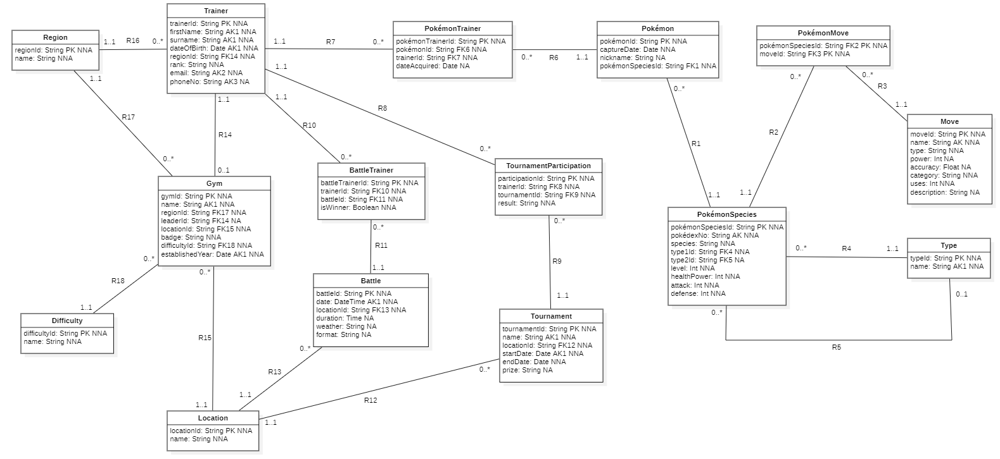

# 📊 SQL Pokémon Database

**A Comprehensive SQL Case Study in Data Modeling & Relational Analysis**

## 📖 Overview

This project features a fully structured relational database built from the ground up for the Pokémon universe. It was
developed to demonstrate mastery in database architecture, relational integrity, and complex analytical querying.

## 🛠️ Technical Highlights

The implementation is divided into logical phases, as seen in the source code:

-   **Schema Design (Part 2):** Architecture of 15+ tables including `pokémonSpecies`, `trainer`, `gym`, and `battle`
    with strict primary and foreign key constraints.
-   **Data Integration (Part 3):** Population of the database with consistent, relational sample data.
-   **Advanced Querying (Parts 4-5):** Mastery of scalar functions, `LIKE` operators, and complex multi-table `JOIN`
    operations (Left/Right/Inner).
-   **Logical Analysis (Parts 6-9):** Utilization of nested subqueries, correlated subqueries, and `GROUP BY/HAVING`
    logic to extract deep data insights.

## 📐 Data Model

The database design follows professional normalization standards to ensure data integrity and reduce redundancy. You can
find the visual schema in the `documentation/` folder.

-   **Visual ERD:** `ERD-Diagram.png`
-   **Source Model:** `Pokemon-Data-Model.mdj` (StarUML)

## 🚀 How to Use

1. Clone the repository.
2. Open the script located at `src/SQL-Pokemon-Database.sql` in your preferred SQL editor (MySQL Workbench, DBeaver,
   etc.).
3. Run the script to create the schema, populate the data, and view the analysis results.

---

_Developed as part of my Data Essentials Course @ Thomas More University of Applied Sciences._

---
